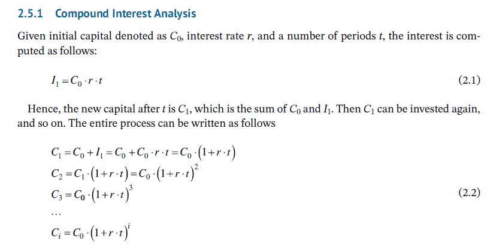
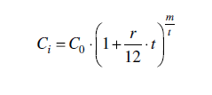

where r denotes an income rate in the compounding period t. However, banks usually provide the
value of r with respect to a yearly period, i.e. 12 months, whereas there can be many compounding
periods per year. Hence, we need to be more granular and set as our basic unit the compounding
period. In other words, our index i will count the number of fully finished compounding periods
in the total investment time. Say we invest for 24 months, and the compounding period is 4 months;
in this time, we will have 6 periods. How did we compute this? 24/4 = 6. In general, the periods are
i = m/t, where m denotes the total investment time expressed in months. On the other hand, in
each period, the investment rate is r/12 · t. For example, if r is 3% and t again is 4 months, then the
interest in this period is 0.03/12 · 4 = 0.01. Thus, we obtain the following equation that will serve
as the basis for our implementation:

where
C0 is the initial capital.
Ci is the final capital after m months of investment (i.e. i = m/t compounding periods).
r is the annual investment rate (expressed as a fraction, so if provided as a percentage, we need
to divide by 100).
t denotes the compounding period in months (e.g. for quarterly compounding, t is three months).
m is the total investment time in months.
Let’s see how this works in practice. Assume we have $2500 to invest, the annual rate is 3.4%, and
the investment and compounding periods both are six months. What will our income be? If we put
all the data into Eq. (2.3), we obtain C1 = 2500$ · (1 + 0.034/12 · 6)(6/6) ≈ 2542.50. Thus, the gain is
C1 – C0 = $42.50. Unfortunately, in some countries, this gain is taxed, so our investment will be
slightly less lucrative.